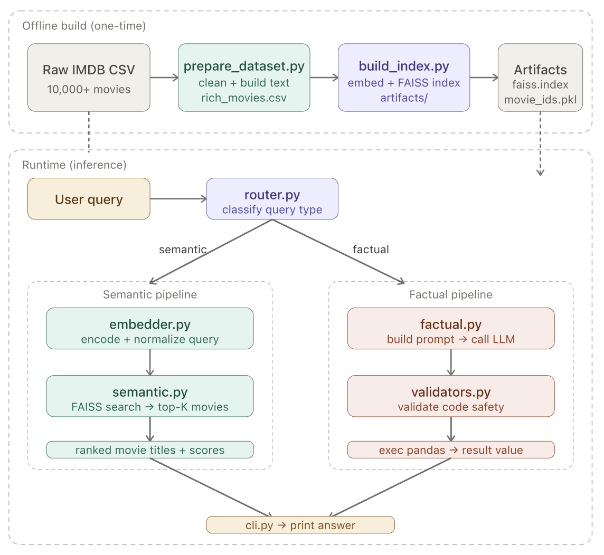

# Movie RAG QA System

> A production-style Retrieval-Augmented Generation (RAG) system for intelligent movie question answering — combining semantic vector search with LLM-powered factual computation.

---

## What It Does

Ask it anything about movies:

| Query type | Example | How it works |
|------------|---------|--------------|
| **Semantic** | *"Movies about AI turning against humans"* | Embeds query → FAISS vector search → top-K similar movies |
| **Factual** | *"Average rating of action movies after 2010"* | LLM generates a pandas expression → validated → executed safely |

The system automatically routes each query to the right pipeline — no manual switching.

---

## Architecture



```
Raw IMDB CSV
  ↓  prepare_dataset.py   — clean data + build rich text descriptions
rich_movies.csv
  ↓  build_index.py       — encode with sentence-transformers + build FAISS index
artifacts/  (faiss.index, movie_ids.pkl, embeddings_norm.npy)

At query time:
  query → router.py
            ├─→ semantic pipeline  (embedder → FAISS → ranked results)
            └─→ factual pipeline   (LLM prompt → validate → exec pandas)
```

---

## Key Design Decisions

**Cosine similarity via dot product** — all vectors are L2-normalized before indexing, so `faiss.IndexFlatIP` (inner product) gives exact cosine similarity without any extra computation at search time.

**LLM as code generator, not answer generator** — for factual queries, the LLM writes a single pandas expression rather than a free-text answer. This gives precise, reproducible results over aggregations, filters, and rankings.

**Multi-layer safety** — LLM-generated code is validated before `exec()`. The validator blocks multi-line code, missing `result =` assignment, dangerous constructs (`import`, `for`, `while`, `open()`, `lambda`), and placeholder ellipsis. Execution scope is limited to only `rich_movies`.

**Swappable LLM backend** — `llm.py` is a stub. Plug in any backend: OpenAI, Ollama, HuggingFace Inference, Anthropic, or a local model.

---

## Project Structure

```
src/movie_rag/
├── config/
│   └── settings.py          # All paths, model name, default top-K
├── preprocessing/
│   ├── clean_movies.py      # Fill missing values, normalize types
│   ├── text_builder.py      # Convert each movie row → rich NL sentence
│   └── prepare_dataset.py   # CLI: raw CSV → rich_movies.csv
├── indexing/
│   ├── embedder.py          # SentenceTransformer wrapper + L2 normalize
│   └── build_index.py       # CLI: CSV → FAISS index + artifacts
├── pipelines/
│   ├── router.py            # Classify query → dispatch to pipeline
│   ├── semantic.py          # FAISS search → ranked movie results
│   └── factual.py           # Prompt → LLM → extract code → exec
├── safety/
│   └── validators.py        # Block unsafe LLM-generated code before exec
├── io/
│   ├── load_data.py         # Load rich_movies.csv
│   └── load_artifacts.py    # Load FAISS index + movie_ids
├── llm.py                   # LLM stub — replace with your implementation
└── cli.py                   # Main entry point
```

---

## Quickstart

### 1. Clone and install

```bash
git clone https://github.com/20krish20/Movie-Question-Answering-System-RAG.git
cd Movie-Question-Answering-System-RAG

python3 -m venv .venv
source .venv/bin/activate

pip install -r requirements.txt
```

### 2. Prepare the dataset

Download the IMDB top 10,000 movies CSV, then run:

```bash
python -m movie_rag.preprocessing.prepare_dataset \
  --input  data/raw/IMDB_top_10000_07132023.csv \
  --output data/processed/rich_movies.csv
```

### 3. Build the FAISS index

```bash
python -m movie_rag.indexing.build_index \
  --data   data/processed/rich_movies.csv \
  --outdir artifacts/
```

This saves `faiss.index`, `embeddings_norm.npy`, and `movie_ids.pkl` into `artifacts/`.

### 4. Wire up the LLM

Open `src/movie_rag/llm.py` and implement `call_llm()` to return a string containing a ` ```python ``` ` block. Example using OpenAI:

```python
from openai import OpenAI

client = OpenAI()

def call_llm(prompt: str) -> str:
    response = client.chat.completions.create(
        model="gpt-4o",
        messages=[{"role": "user", "content": prompt}]
    )
    return response.choices[0].message.content
```

Or use Ollama for a fully local setup:

```python
import requests

def call_llm(prompt: str) -> str:
    r = requests.post("http://localhost:11434/api/generate",
        json={"model": "llama3", "prompt": prompt, "stream": False})
    return r.json()["response"]
```

### 5. Run a query

```bash
# Semantic query
python -m movie_rag.cli --query "movies about AI turning against humans"

# Factual query
python -m movie_rag.cli --query "what is the average rating of action movies after 2010"
```

---

## Example Output

**Semantic query:**
```
QUERY: movies about AI turning against humans
TYPE: semantic | PIPELINE: semantic_pipeline

ANSWER:
1. Ex Machina (2014) — score=0.821
2. I, Robot (2004) — score=0.798
3. 2001: A Space Odyssey (1968) — score=0.776
4. Terminator 2: Judgment Day (1991) — score=0.761
5. Her (2013) — score=0.743
```

**Factual query:**
```
QUERY: what is the average rating of action movies after 2010
TYPE: factual | PIPELINE: factual_pipeline

GENERATED CODE:
result = rich_movies[(rich_movies["Genres"].str.contains("Action")) & (rich_movies["Year"] > 2010)]["Rating"].mean()

RESULT: 6.84
```

---

## Requirements

```
pandas
numpy
faiss-cpu
sentence-transformers
torch
transformers
scikit-learn
```

> On Apple Silicon (M1/M2/M3/M4/M5), `faiss-cpu` compiles from source — allow a few extra minutes on first install.

---

## Tech Stack

- **Embeddings**: `sentence-transformers/all-mpnet-base-v2` (768-dim, L2-normalized)
- **Vector index**: FAISS `IndexFlatIP` — exact cosine search
- **Factual engine**: LLM → pandas code generation → sandboxed `exec()`
- **Safety**: multi-rule code validator before any execution
- **LLM backend**: pluggable — OpenAI, Anthropic, Ollama, HuggingFace, or any custom backend

---

## License

MIT
