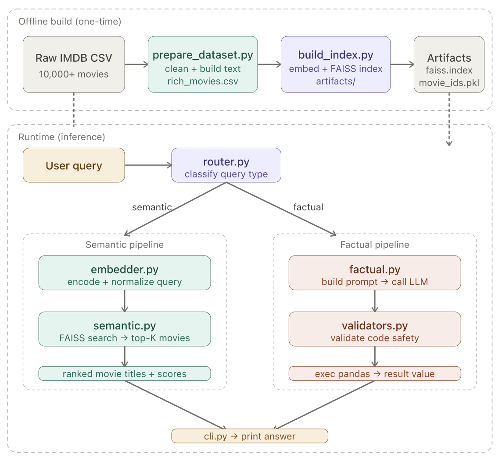

# Movie RAG QA

**[Try the live demo →](https://movie-question-answering-system-rag-aa3kjbv2aaimqw5hwf292m.streamlit.app)**

Ask questions about the IMDB top 1000 movies in plain English. It handles two very different kinds of questions:

| You ask | What happens |
|---|---|
| *"Movies about AI turning against humans"* | Semantic search finds The Terminator, Ex Machina, The Matrix |
| *"How many movies did Martin Scorsese direct?"* | An LLM writes one line of pandas, it runs safely, answer: **10** |

A router decides which path each question takes.



## What I found interesting

- **LLMs are bad at arithmetic, so it doesn't let them do it.** For numeric questions the LLM only writes a pandas expression. Pandas computes the answer, so it's exact and you can see the code that produced it.
- **Running LLM-written code on a public site is risky.** Every generated line is parsed and checked against an allowlist before it runs: no imports, no file writes, no dunder tricks, no in-place edits. I tested it with a prompt injection. The model did write `__import__` code, and the validator blocked it.
- **Less text made search better.** Taking ratings, votes and box-office numbers out of the embedded text raised recall@10 from 10/25 to 13/25 on a small labelled set. The numbers were noise for search, and the factual path handles them anyway.
- **It fits free hosting.** The embedding model runs as an 8-bit ONNX file instead of PyTorch. Memory went from ~860MB to ~475MB with the same retrieval quality.

## Stack

`all-mpnet-base-v2` (ONNX via fastembed) · FAISS · pandas · Groq `gpt-oss-120b` (free tier, any OpenAI-compatible API works) · Streamlit · pytest + GitHub Actions

## Run it locally

```bash
pip install -r requirements.txt
export LLM_API_KEY=gsk_...          # free key from console.groq.com; optional, semantic search works without it
streamlit run streamlit_app.py
```

The processed data and FAISS index are committed, so it works right after cloning. To rebuild them from the [Kaggle dataset](https://www.kaggle.com/datasets/harshitshankhdhar/imdb-dataset-of-top-1000-movies-and-tv-shows):

```bash
export PYTHONPATH=src
python -m movie_rag.preprocessing.prepare_dataset --input data/raw/imdb_top_1000.csv --output data/processed/rich_movies.csv
python -m movie_rag.indexing.build_index --data data/processed/rich_movies.csv --outdir artifacts/
```

Tests: `pip install -r requirements-dev.txt && pytest -q`. They cover the router, both pipelines and the safety validator, and run in CI on every push.

## Code layout

```
src/movie_rag/
├── pipelines/      router, semantic search, factual (LLM → pandas)
├── safety/         validator for generated code
├── preprocessing/  cleaning + text for embeddings
├── indexing/       embedder + FAISS index build
└── llm.py          OpenAI-compatible client
streamlit_app.py    the web app
```

## License

MIT
